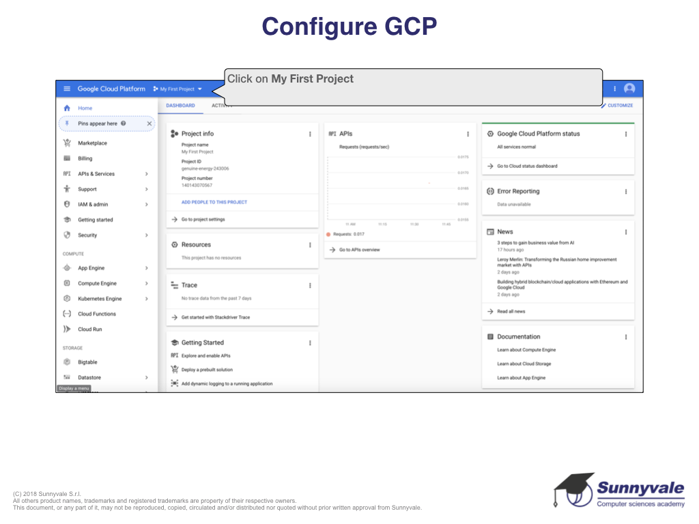
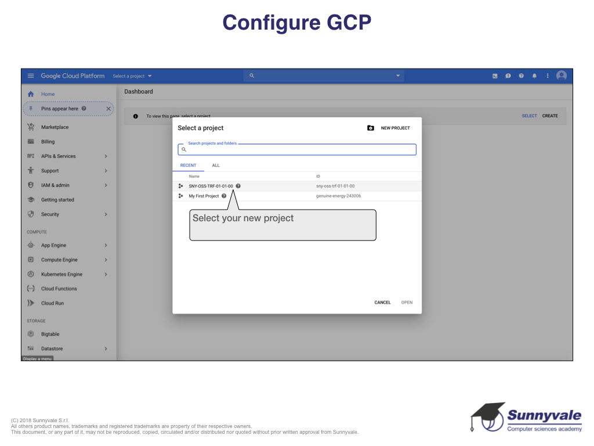
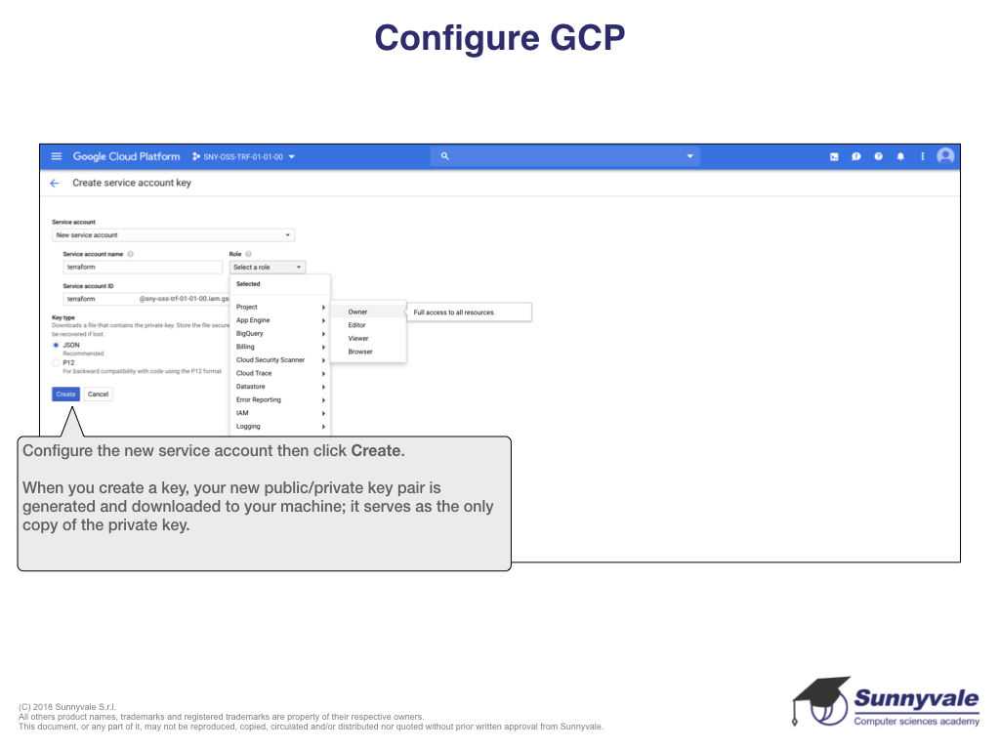

# Getting started

## Configure Google Cloud Platform

 


 

 

 

 

 

 

 

 

 


## Lab VM setup

Please refer to [Vagrant](../../vagrant/README.md) instructions


## Configure Terraform (within the VM)

Connect to the VM using ssh

```
$ cd <GIT_REPO_NAME>/vagrant
$ vagrant ssh
```

Move to the right path and create your lab folder

```
vagrant@terraform-vm$ cd ~/$GIT_REPO_NAME/labs/01-Getting_started
```

Create a new directory for the project to live and create a main.tf file for the Terraform config. The contents of this file describe all of the GCP resources that will be used in the project.

```
vagrant@terraform-vm$ mkdir mylab
vagrant@terraform-vm$ cd mylab
vagrant@terraform-vm$ vi main.tf
```

Write the following code into main.tf file

```
// Configure the Google Cloud provider
provider "google" {
 credentials = "${file("<CREDENTIALS_JSON_FILE>")}"
 project     = "<GCP_PROJECT_ID>"
 region      = "europe-west4"
}
```


