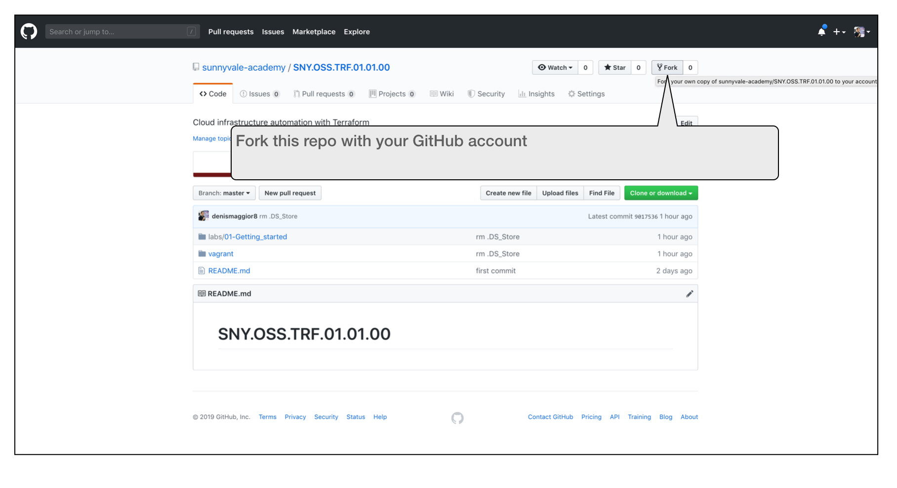

# Lab VM setup

## Prerequisites

The following softwares have to be installed on you host machine

- Git client [download here](https://git-scm.com/downloads)
- Virtualbox [download here](https://www.virtualbox.org/wiki/Downloads)
- Vagrant [download here](https://www.vagrantup.com/downloads.html)
- Bash command line (Git bash, Moba or Cygwin if you are on Windows) 
- A GitHub account

## VM provisioning

Install the Vagrant hostmanager plugin

```
$ vagrant plugin install vagrant-hostmanager
```

## Fork GitHub repo 

Fork the https://github.com/sunnyvale-academy/SNY.OSS.TRF.01.01.00 repo to your Github account.



Then clone the repo you forked (change <YOUR_GITHUB_USERNAME> and <GIT_REPO_NAME> placeholders accordingly)

```
$ git clone https://github.com/<YOUR_GITHUB_USERNAME>/<GIT_REPO_NAME>.git
```

```
$ cd <GIT_REPO_NAME>/vagrant/scripts
$ vi .env
```

Change the following variables into the file (GCP_SA_CREDENTIALS_FILENAME is the GCP json filename):

```
export GIT_USERNAME=
export GIT_REPO_NAME=
export GCP_SA_CREDENTIALS_FILENAME=
```

Copy the previously downloaded GCP json file as described here:

```
$ cp ~/Downloads/SNY-OSS-TRF-01-01-00-870577b1e676.json <GIT_REPO_NAME>/gcp
```

Start the VM provisioning process

```
$ cd <GIT_REPO_NAME>/vagrant
$ vagrant up
```

Enter into the newly born VM

```
$ vagrant ssh
```

